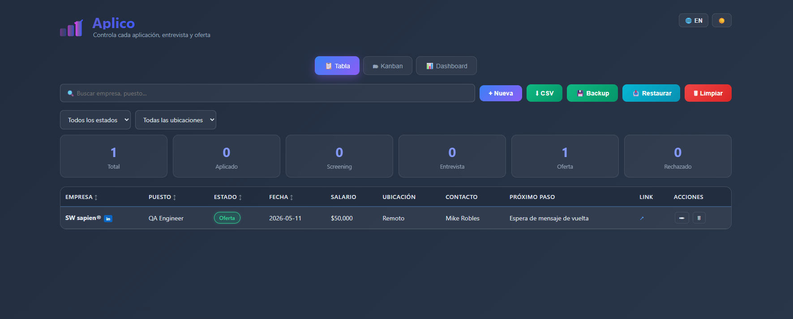
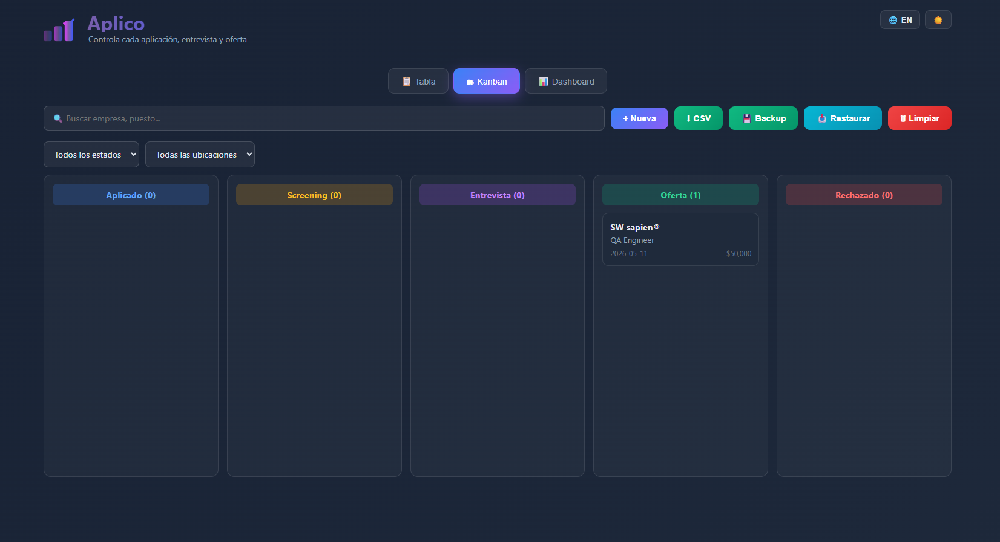
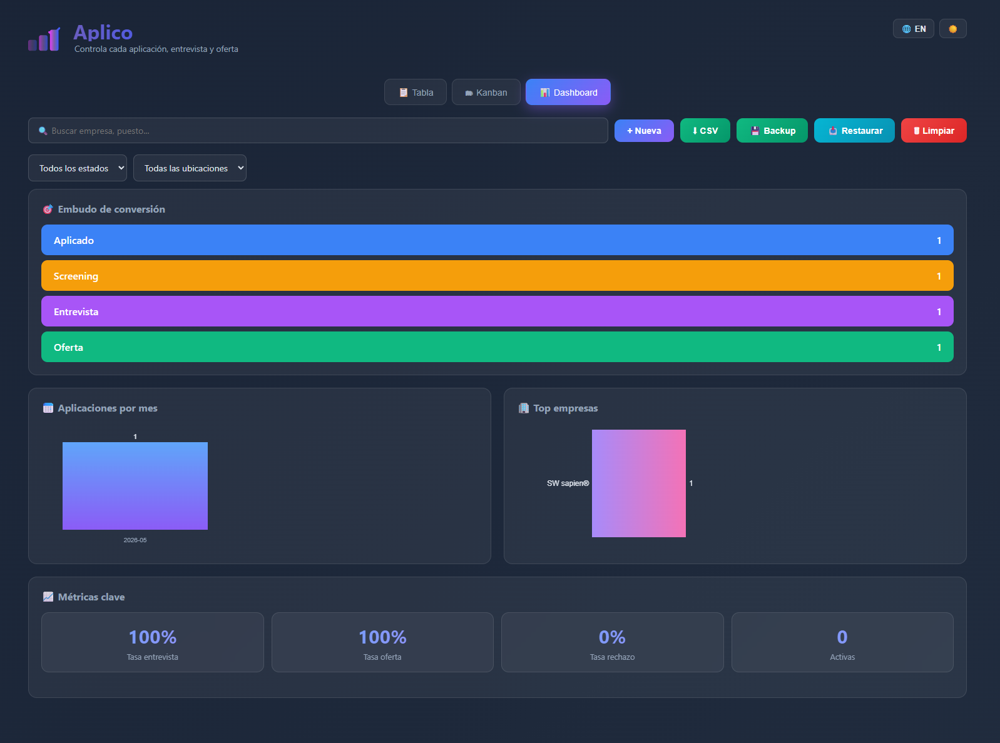
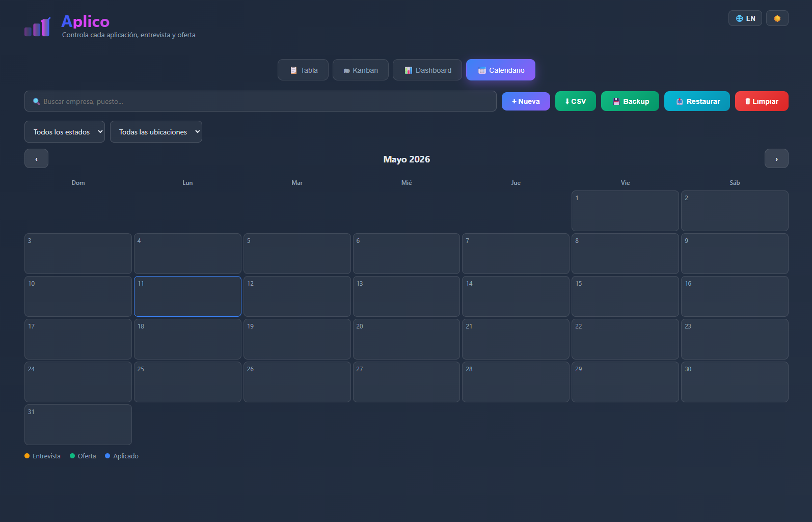

# Aplico — Job Tracker

<p align="center">
  <svg width="80" height="72" viewBox="0 0 90 68" xmlns="http://www.w3.org/2000/svg">
    <defs>
      <linearGradient id="g" x1="0%" y1="0%" x2="100%" y2="0%">
        <stop offset="0%" stop-color="#E040FB"/>
        <stop offset="50%" stop-color="#7B5EA7"/>
        <stop offset="100%" stop-color="#3D5AFE"/>
      </linearGradient>
    </defs>
    <polyline points="54,20 63,28 80,10" fill="none" stroke="url(#g)" stroke-width="5" stroke-linecap="round" stroke-linejoin="round"/>
    <rect x="0"  y="40" width="22" height="28" rx="5" fill="url(#g)" opacity="0.4"/>
    <rect x="28" y="28" width="22" height="40" rx="5" fill="url(#g)" opacity="0.7"/>
    <rect x="56" y="14" width="22" height="54" rx="5" fill="url(#g)"/>
  </svg>
</p>

<p align="center">
  <strong>Herramienta gratuita y open-source para llevar el control de tus aplicaciones de trabajo.</strong><br>
  Sin registro, sin servidor — tus datos se quedan en tu navegador.
</p>

<p align="center">
  <a href="https://luiselizondotech-dotcom.github.io/job-tracker/">🚀 Demo en vivo</a> &nbsp;·&nbsp;
  <a href="#instalación">Instalación</a> &nbsp;·&nbsp;
  <a href="#features">Features</a>
</p>

---

## Screenshots

### Vista Tabla
<p align="center">

</p>

### Vista Kanban
<p align="center">

</p>

### Dashboard & Embudo
<p align="center">

</p>

### Vista Calendario
<p align="center">

</p>

---

## Features

| | Feature |
|---|---|
| 📋 | **4 vistas:** Tabla, Kanban drag & drop, Dashboard con embudo, Calendario mensual |
| 🌐 | **Bilingüe:** Español / Inglés con un clic |
| 🌙 | **Tema claro / oscuro** |
| ⭐ | **Evaluación post-entrevista** de 1 a 5 estrellas |
| 🏷️ | **Tags personalizables** por aplicación (urgente, remoto, referido…) |
| 🔔 | **Recordatorios automáticos** — entrevistas próximas y aplicaciones sin respuesta |
| 🔍 | **Filtros y búsqueda** por estado, ubicación y texto libre |
| ↕️ | **Ordenamiento** por cualquier columna |
| 🤖 | **Autocompletado** de empresa y puesto basado en historial |
| 💼 | **Botón LinkedIn** — busca la empresa con un clic |
| 📊 | **Stats en tiempo real:** total, por estado, tasas de conversión |
| 💾 | **Export CSV** y backup / restore JSON |
| 📱 | **PWA installable** — instálala desde Chrome sin app store |
| ⌨️ | **Atajo Ctrl+N** para nueva aplicación |
| 🔒 | **100% privado** — nada se sube a ningún servidor |

---

## Instalación

### Opción 1: Versión web (recomendado)

Abre **https://luiselizondotech-dotcom.github.io/job-tracker/** y empieza. En Chrome verás el botón para instalarla como app.

> Si limpias el caché del navegador, exporta un backup JSON primero.

### Opción 2: Clonar y abrir local

```bash
git clone https://github.com/luiselizondotech-dotcom/job-tracker.git
cd job-tracker/docs
# Abre index.html con doble clic
```

### Opción 3: App de escritorio (Electron / Windows)

```bash
cd electron
npm install
npm start        # ejecutar
npm run build    # generar instalador .exe
```

---

## Estructura

```
job-tracker/
├── .github/
│   └── workflows/
│       └── deploy.yml     # Deploy automático a GitHub Pages
├── docs/                  # Versión web
│   ├── index.html
│   ├── manifest.json      # PWA manifest
│   └── service-worker.js  # Offline support
├── electron/              # Versión escritorio
│   ├── main.js
│   ├── preload.js
│   ├── package.json
│   └── src/index.html
├── LICENSE
└── README.md
```

---

## Campos por aplicación

Empresa, puesto, estado (Aplicado / Screening / Entrevista / Oferta / Rechazado), fecha, salario, ubicación, contacto, próximo paso con fecha, link de la vacante, evaluación 1-5 ⭐, tags personalizables y notas libres.

---

## Privacidad

No hay backend. No hay analytics. No hay cookies de rastreo. Tus datos viven solo en localStorage de tu navegador o de la app Electron.

---

## Tips para sacarle el máximo

- Registra cada aplicación el mismo día que la envías.
- Actualiza el estado apenas cambie — no lo dejes para después.
- Si tu tasa aplicado→entrevista es menor al 10%, revisa tu CV o filtra mejor las vacantes.
- Si tu tasa entrevista→oferta es menor al 30%, practica entrevistas técnicas y conductuales.
- Usa los tags para priorizar: `urgente`, `referido`, `remoto`.
- Después de cada entrevista, usa las estrellas y las notas para comparar ofertas objetivamente.

---

## Contribuir

Pull requests son bienvenidos. Para cambios grandes, abre un issue primero.

## Licencia

MIT — úsalo, modifícalo, compártelo libremente.

---

<p align="center">Hecho por <a href="https://github.com/luiselizondotech-dotcom">@luiselizondotech-dotcom</a></p>
